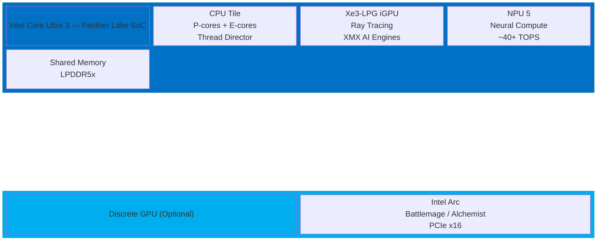
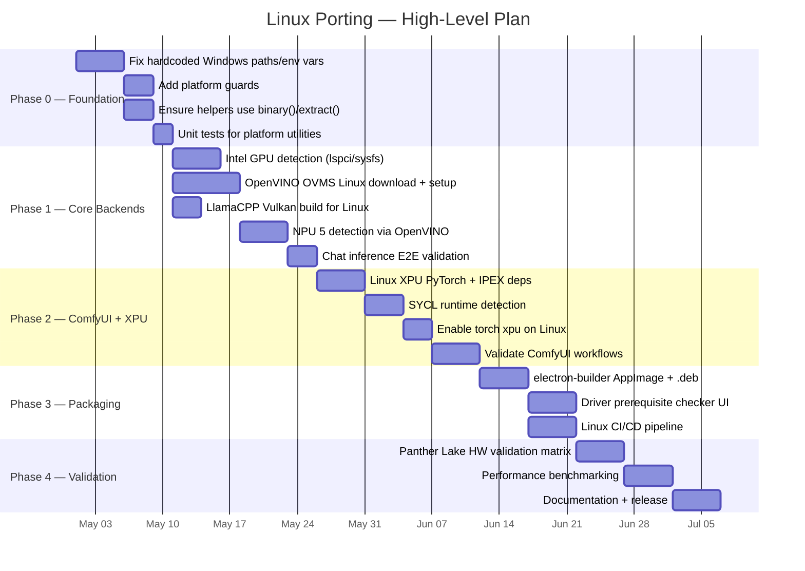
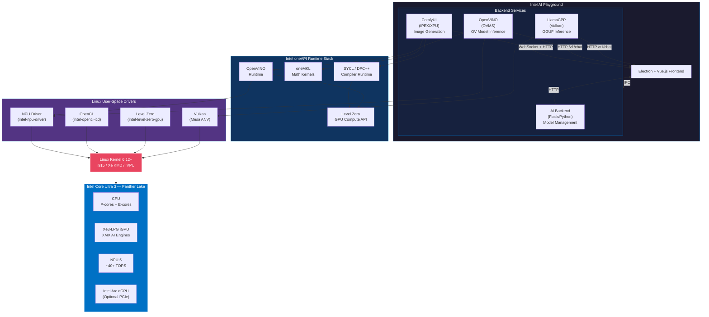
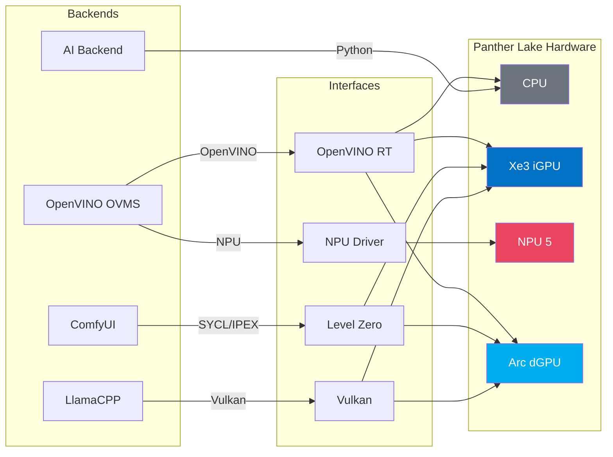
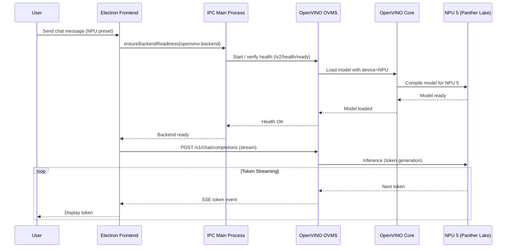
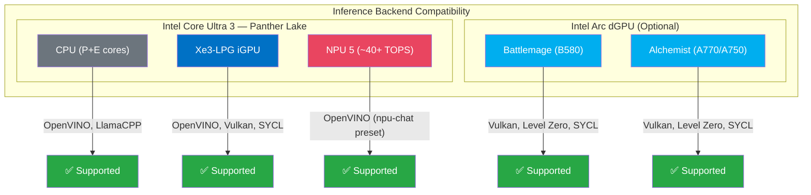

# Intel AI Playground — Linux Porting Proposal

**Target Platform:** Ubuntu 24.04 LTS (Noble Numbat) and higher  
**Target Hardware:** Intel Core Ultra 3 (Panther Lake) — CPU, integrated GPU (Xe3), discrete GPU (Intel Arc), NPU 5  
**Date:** April 2026  
**Status:** Draft Proposal

---

## Table of Contents

1. [Executive Summary](#1-executive-summary)
2. [Current State Assessment](#2-current-state-assessment)
3. [Technical Gap Analysis](#3-technical-gap-analysis)
4. [High-Level Technical Plan](#4-high-level-technical-plan)
5. [Detailed Work Breakdown](#5-detailed-work-breakdown)
6. [Dependency & Driver Matrix](#6-dependency--driver-matrix)
7. [Risk Assessment](#7-risk-assessment)
8. [Recommended Phased Approach](#8-recommended-phased-approach)

---

## 1. Executive Summary

Intel AI Playground is an Electron + Vue.js desktop application that runs AI inference on Intel GPUs using four backend services (AI Backend, LlamaCPP, OpenVINO, ComfyUI). It currently ships as a Windows-only NSIS installer.

The codebase already contains partial Linux support — the Electron shell, AI Backend (Flask), and LlamaCPP backend work on Ubuntu x64 in development mode. However, **GPU-accelerated inference, hardware detection, OpenVINO backend, ComfyUI backend, NPU support, and packaging are all non-functional on Linux**.

This document identifies every technical gap, proposes a phased implementation plan, and covers the Intel driver/runtime stack required for full CPU + GPU + NPU support on Ubuntu 24.04+.

The primary target hardware is **Intel Core Ultra 3 (Panther Lake)**, which integrates:
- **CPU:** P-cores + E-cores (Intel Thread Director)
- **iGPU:** Xe3-LPG integrated graphics with enhanced AI acceleration
- **NPU 5:** Next-gen Neural Processing Unit with significantly improved TOPS
- **Discrete GPU support:** Intel Arc (Battlemage / Alchemist) via PCIe

### Target Hardware Architecture



---

## 2. Current State Assessment

### What Already Works on Linux

| Component | Status | Notes |
|-----------|--------|-------|
| Electron app shell | ✅ Working | Runs with `DISPLAY=:1 npm run dev` |
| Vite dev server | ✅ Working | Hot reload, Vue SFC compilation |
| AI Backend (Flask) | ✅ Working | Model download/management on port 59000 |
| LlamaCPP Backend | ⚠️ Partial | Downloads `ubuntu-x64` **CPU-only** build; no GPU acceleration |
| `fetch-external-resources` | ✅ Working | Downloads Linux `uv` and `7zip` binaries |
| Git service | ✅ Working | Uses system git on non-Windows |
| NVIDIA GPU detection | ✅ Working | `nvidia-smi` is cross-platform |
| Cross-platform helpers | ✅ Working | `binary()`, `extract()`, PATH separator in some files |

### What Does NOT Work on Linux

| Component | Status | Blocker |
|-----------|--------|---------|
| Intel GPU detection | ❌ Broken | `xpu-smi.exe` Win32-only; PowerShell WMI fallback Win32-only |
| Intel NPU 5 detection | ❌ Broken | Relies on OpenVINO backend device enumeration (which doesn't install on Linux) |
| OpenVINO Backend (OVMS) | ❌ Broken | Downloads only `ovms_windows_python_on.zip`; uses `powershell Expand-Archive` |
| ComfyUI Backend | ❌ Broken | XPU torch backend defaults to `'cpu'` on Linux; SYCL runtime wheels are Win32-only |
| LlamaCPP GPU inference | ❌ Missing | Linux build is CPU-only (`ubuntu-x64` vs `win-vulkan-x64`) |
| Electron packaging | ❌ Missing | No Linux target in `build-config.json`; NSIS installer is Windows-only |
| Intel GPU driver checks | ❌ Missing | No driver version validation on Linux |
| PATH separators (ComfyUI, OVMS) | ❌ Hardcoded | `;` separator used in 2 backend services |
| `PIP_CONFIG_FILE` env | ❌ Broken | Set to `'nul'` (Windows null device) instead of `/dev/null` |
| Windows Registry reads | ❌ Broken | `updateIntelPresets.ts` calls PowerShell without platform guard |

---

## 3. Technical Gap Analysis

### Gap 1: Intel GPU Hardware Detection

**Current:** Two detection methods, both Windows-only:
- `xpu-smi.exe discovery -j` — bundled Win32 binary
- `Get-CimInstance Win32_VideoController` — PowerShell WMI query

**Linux Equivalent Options:**
- `xpu-smi` is available as part of `intel-xpumanager` APT package on Ubuntu. Provides identical JSON output.
- `lspci -nn | grep VGA` — PCI device enumeration, universally available.
- `/sys/class/drm/card*/device/vendor` + `/sys/class/drm/card*/device/device` — sysfs entries.
- `intel_gpu_top -L` (from `intel-gpu-tools` package) — lists Intel GPUs.
- `clinfo` — OpenCL device enumeration if Level Zero runtime is installed.

**Recommended:** Use system-installed `xpu-smi` (if available) with `lspci` as fallback. Parse sysfs for vendor `0x8086` as a final fallback.

**Files to modify:**
- `WebUI/electron/subprocesses/hardwareDiscovery.ts` — add `detectIntelGpusViaLspci()` and `detectIntelGpusViaSysfs()` methods
- `WebUI/build/scripts/build-paths.mts` — no longer need to bundle `xpu-smi` for Linux

---

### Gap 2: OpenVINO Backend (OVMS) Linux Support

**Current:** Downloads `ovms_windows_python_on.zip` from a hardcoded URL. Extraction uses `powershell Expand-Archive`. Executable path hardcodes `ovms.exe`.

**Linux Requirements:**
- OVMS is available as native Linux binaries, Docker containers, and APT packages from Intel's repository.
- The recommended approach is to download the OVMS Linux binary release or use the APT package.
- OVMS on Linux supports CPU, GPU (via OpenCL/Level Zero), and NPU natively.

**Files to modify:**
- `WebUI/electron/subprocesses/openVINOBackendService.ts`:
  - Add Linux download URL for OVMS binary
  - Replace `ovms.exe` with `binary('ovms')`
  - Replace `powershell Expand-Archive` with `extract()` helper
  - Fix hardcoded `;` PATH separator → `path.delimiter`
  - Fix `PIP_CONFIG_FILE: 'nul'` → platform-aware null device

---

### Gap 3: ComfyUI Backend Linux + Intel GPU Support

**Current:** ComfyUI XPU variant sets `torchBackendValue = process.platform === 'win32' ? 'xpu' : 'cpu'`, forcing CPU-only on Linux. SYCL runtime Python wheels (`intel-sycl-rt`, `onemkl-sycl-*`) in `comfyui-deps/uv.lock` are `sys_platform == 'win32'` only.

**Linux Requirements:**
- Intel Extension for PyTorch (IPEX) for Linux supports XPU via Level Zero/SYCL since version 2.1+.
- PyTorch XPU wheels for Linux are available from Intel's PyPI index (`https://pytorch-extension.intel.com/release-whl/stable/xpu/`).
- SYCL runtime on Linux comes from the `intel-oneapi-runtime-*` APT packages, not pip wheels.
- The `ipex_to_cuda` hijacks module needs a Linux platform guard review.

**Files to modify:**
- `WebUI/electron/subprocesses/comfyUIBackendService.ts`:
  - Allow `'xpu'` torch backend on Linux when Level Zero / SYCL runtime is available
  - Fix hardcoded `;` PATH separator → `path.delimiter`
  - Fix `PIP_CONFIG_FILE: 'nul'` → platform-aware null device
- `comfyui-deps/pyproject.toml` and lockfile:
  - Add Linux XPU PyTorch + IPEX dependencies
  - Remove `sys_platform == 'win32'` restriction on XPU-related packages or add Linux alternatives
- `WebUI/electron/subprocesses/service.ts`:
  - Review `installHijacks()` — currently only guards against macOS, not Linux

---

### Gap 4: LlamaCPP GPU-Accelerated Inference on Linux

**Current:** Downloads `ubuntu-x64` (CPU-only) build. Windows gets `win-vulkan-x64` (Vulkan GPU acceleration).

**Linux Requirements:**
- `llama.cpp` releases include `linux-vulkan-x64` builds that support Intel GPUs via Vulkan.
- Intel's compute-runtime + Vulkan drivers (`mesa-vulkan-drivers` or `intel-media-va-driver`) enable Vulkan on Intel GPUs.
- Alternative: SYCL backend for llama.cpp provides native Level Zero support for Intel GPUs (available as separate release builds).

**Files to modify:**
- `WebUI/electron/subprocesses/llamaCppBackendService.ts`:
  - Change `linux: 'ubuntu-x64'` to `linux: 'linux-vulkan-x64'` (or detect Vulkan availability and choose accordingly)

---

### Gap 5: NPU 5 Support on Linux (Panther Lake)

**Current:** NPU detection works through OpenVINO's `openvino.Core().available_devices` which reports `NPU` when the NPU driver is loaded. Since the OpenVINO backend doesn't install on Linux (Gap 2), NPU is unreachable.

**Panther Lake NPU 5 Considerations:**
- Panther Lake ships with **NPU 5**, a significant upgrade over previous NPU generations with ~40+ TOPS.
- The `intel-npu-driver` package must support the Panther Lake NPU device ID. Newer kernels (6.12+) are expected to have upstream i915/Xe and IVPU driver support for Panther Lake.
- OpenVINO 2025.x+ is expected to have full NPU 5 support on Linux.
- The `intel-driver-compiler-npu` and `intel-fw-npu` packages must be version-matched for Panther Lake.

**Linux Requirements:**
- Intel NPU driver for Linux (`intel-npu-driver`) — ensure Panther Lake device IDs are supported.
- Kernel 6.10+ recommended for full Panther Lake NPU 5 support (Ubuntu 24.04 HWE kernel or 24.10+).
- OpenVINO 2025.x+ supports NPU 5 on Linux natively.
- Once the OpenVINO backend gap is resolved, NPU detection should work out-of-the-box via the same Python-based device enumeration.

**Verification needed:**
- Confirm OVMS Linux binary supports NPU 5 device pass-through on Panther Lake
- If OVMS doesn't support NPU 5, consider using OpenVINO GenAI directly for NPU inference
- Validate NPU 5 performance uplift vs Meteor Lake/Arrow Lake NPU on Linux

---

### Gap 6: Electron Packaging for Linux

**Current:** `build-config.json` only defines a `"win"` NSIS target. `installer.nsh` installs VC++ Redistributable and runs Windows-specific migration scripts.

**Linux Requirements:**
- electron-builder supports Linux targets: AppImage, `.deb`, `.rpm`, Snap, Flatpak
- AppImage is the most universal (no root, works on any distro)
- `.deb` is best for Ubuntu target audience
- Need to bundle `uv`, `7zr` binaries (already downloaded by `fetch-external-resources`)
- Do NOT bundle `xpu-smi` — use system package on Linux

**Files to modify:**
- `WebUI/build/build-config.json` — add `"linux"` section with `deb` + `AppImage` targets
- Create `WebUI/build/linux/` directory for Linux-specific packaging scripts (post-install, desktop file, icons)
- `WebUI/package.json` — add Linux build script

---

### Gap 7: Environment Variable & Path Hardcoding Issues

Multiple files contain Windows-specific environment values:

| Issue | Files Affected | Fix |
|-------|---------------|-----|
| `PIP_CONFIG_FILE: 'nul'` | `aiBackendService.ts`, `comfyUIBackendService.ts`, `openVINOBackendService.ts` | `process.platform === 'win32' ? 'nul' : '/dev/null'` |
| PATH separator `;` hardcoded | `comfyUIBackendService.ts`, `openVINOBackendService.ts` | Use `path.delimiter` |
| `powershell.exe` in `updateIntelPresets.ts` | `updateIntelPresets.ts` | Add `if (process.platform !== 'win32') return` guard |
| `ovms.exe` hardcoded | `openVINOBackendService.ts` | Use `binary('ovms')` |
| `explorer.exe /select` for file reveal | `main.ts` (2 locations) | Already has fallback ✅ |

---

### Gap 8: Intel Driver & Runtime Stack on Linux

Unlike Windows where drivers auto-install, Linux requires explicit driver/runtime installation:

| Component | Ubuntu Package(s) | Purpose |
|-----------|-------------------|---------|
| Intel GPU kernel driver | `linux-firmware`, `i915` (in-kernel) | Base GPU driver (included in kernel 6.2+) |
| Intel compute runtime | `intel-opencl-icd`, `intel-level-zero-gpu` | OpenCL + Level Zero user-space drivers |
| Vulkan driver | `mesa-vulkan-drivers` | Vulkan support for LlamaCPP |
| oneAPI runtime | `intel-oneapi-runtime-compilers`, `intel-oneapi-runtime-mkl` | SYCL/DPC++ runtime for IPEX |
| NPU driver | `intel-npu-driver`, `intel-fw-npu` | NPU 5 acceleration (Panther Lake / Arrow Lake / Meteor Lake) |
| OpenVINO runtime | `openvino` (pip) or `intel-openvino-*` (APT) | OpenVINO inference |
| Intel XPU Manager | `intel-xpumanager` | `xpu-smi` for GPU detection |

**The application should detect missing drivers/runtimes and guide users through installation**, either via:
- A setup wizard page listing required packages with copy-paste `apt install` commands
- An optional auto-install script (requires `sudo`)

---

## 4. High-Level Technical Plan



---

## 5. Detailed Work Breakdown

### Phase 0: Foundation — Cross-Platform Fixes

These are low-risk, high-value fixes that make the codebase Linux-ready without changing behavior on Windows.

| # | Task | File(s) | Complexity |
|---|------|---------|------------|
| 0.1 | Replace hardcoded `;` PATH separator with `path.delimiter` | `comfyUIBackendService.ts`, `openVINOBackendService.ts` | Low |
| 0.2 | Fix `PIP_CONFIG_FILE: 'nul'` → platform-aware null device | `aiBackendService.ts`, `comfyUIBackendService.ts`, `openVINOBackendService.ts` | Low |
| 0.3 | Add platform guard to `getFromRegistry()` in `updateIntelPresets.ts` | `updateIntelPresets.ts` | Low |
| 0.4 | Use `binary('ovms')` instead of `ovms.exe` | `openVINOBackendService.ts` | Low |
| 0.5 | Use `extract()` helper in OVMS download instead of `powershell Expand-Archive` | `openVINOBackendService.ts` | Low |
| 0.6 | Audit all `.exe` string literals not wrapped in `binary()` | All subprocess files | Low |
| 0.7 | Verify `installHijacks()` behavior on Linux | `service.ts` | Low |

### Phase 1: Core Linux Backend Support

| # | Task | File(s) | Complexity |
|---|------|---------|------------|
| 1.1 | Implement `detectIntelGpusViaLspci()` for Linux | `hardwareDiscovery.ts` | Medium |
| 1.2 | Implement sysfs-based fallback detection | `hardwareDiscovery.ts` | Medium |
| 1.3 | Add system `xpu-smi` detection (if installed via APT) | `hardwareDiscovery.ts` | Low |
| 1.4 | Add Linux OVMS binary download URL and archive handling | `openVINOBackendService.ts` | Medium |
| 1.5 | Test OpenVINO device detection on Linux (CPU, GPU, NPU) | `openVINOBackendService.ts` | Medium |
| 1.6 | Switch LlamaCPP Linux download to Vulkan build (`linux-vulkan-x64`) | `llamaCppBackendService.ts` | Low |
| 1.7 | Add Vulkan availability detection on Linux | `hardwareDiscovery.ts` or `llamaCppBackendService.ts` | Medium |
| 1.8 | Validate NPU pass-through in Linux OVMS | Manual testing | Medium |

### Phase 2: ComfyUI + XPU on Linux

| # | Task | File(s) | Complexity |
|---|------|---------|------------|
| 2.1 | Add Linux XPU PyTorch + IPEX deps to `comfyui-deps/pyproject.toml` | `comfyui-deps/pyproject.toml` | Medium |
| 2.2 | Detect SYCL runtime availability on Linux (check for `libsycl.so`) | New utility or `comfyUIBackendService.ts` | Medium |
| 2.3 | Enable `torchBackendValue = 'xpu'` on Linux when SYCL is available | `comfyUIBackendService.ts` | Low |
| 2.4 | Add oneAPI runtime library paths to `LD_LIBRARY_PATH` | `comfyUIBackendService.ts` | Medium |
| 2.5 | Test `ipex_to_cuda` hijacks on Linux ComfyUI | `service.ts` | Medium |
| 2.6 | Validate ComfyUI image generation on Intel GPU (Linux) | Manual testing | High |

### Phase 3: Packaging & Distribution

| # | Task | File(s) | Complexity |
|---|------|---------|------------|
| 3.1 | Add `"linux"` target to `build-config.json` (AppImage + deb) | `build-config.json` | Medium |
| 3.2 | Create Linux desktop entry file (`.desktop`) | New file in `build/linux/` | Low |
| 3.3 | Create app icon set for Linux (PNG 16x16 to 512x512) | New files in `build/linux/` | Low |
| 3.4 | Implement driver/runtime prerequisite check UI | New Vue component + IPC channel | High |
| 3.5 | Create post-install script for `.deb` package | New file in `build/linux/` | Medium |
| 3.6 | Add Linux build to CI/CD pipeline (GitHub Actions) | `.github/workflows/` | Medium |
| 3.7 | Test auto-update mechanism on Linux (if applicable) | electron-builder auto-update | Medium |

### Phase 4: Polish & Validation

| # | Task | Complexity |
|---|------|------------|
| 4.1 | E2E test: Chat inference via LlamaCPP Vulkan on Panther Lake iGPU + Arc dGPU | High |
| 4.2 | E2E test: Chat inference via OpenVINO on Panther Lake CPU/iGPU/NPU 5 | High |
| 4.3 | E2E test: Image generation via ComfyUI on Panther Lake iGPU + Arc dGPU | High |
| 4.4 | E2E test: Model download + management via AI Backend | Medium |
| 4.5 | E2E test: RAG document processing | Medium |
| 4.6 | Performance benchmark: Linux vs Windows on identical hardware | Medium |
| 4.7 | User documentation: installation guide, driver setup, troubleshooting | Medium |

---

## 6. Dependency & Driver Matrix

### Ubuntu 24.04 LTS — Required System Packages

```bash
# Intel GPU compute drivers (Level Zero + OpenCL)
sudo apt install -y \
  intel-opencl-icd \
  intel-level-zero-gpu \
  level-zero \
  level-zero-dev

# Vulkan support (for LlamaCPP GPU inference)
sudo apt install -y \
  mesa-vulkan-drivers \
  vulkan-tools

# Intel oneAPI runtime (for IPEX/SYCL — ComfyUI XPU)
# Add Intel APT repository first:
wget -qO - https://apt.repos.intel.com/intel-gpg-keys/GPG-PUB-KEY-INTEL-SW-PRODUCTS.PUB | \
  sudo gpg --dearmor -o /usr/share/keyrings/intel-sw-products.gpg
echo "deb [signed-by=/usr/share/keyrings/intel-sw-products.gpg] \
  https://apt.repos.intel.com/oneapi all main" | \
  sudo tee /etc/apt/sources.list.d/intel-oneapi.list
sudo apt update
sudo apt install -y \
  intel-oneapi-runtime-compilers \
  intel-oneapi-runtime-mkl

# Intel NPU driver (Panther Lake / Arrow Lake / Lunar Lake / Meteor Lake)
sudo apt install -y \
  intel-npu-driver \
  intel-fw-npu

# Intel XPU Manager (optional, for xpu-smi GPU detection)
sudo apt install -y intel-xpumanager

# General dependencies
sudo apt install -y \
  git \
  python3 \
  python3-pip \
  libvulkan1
```

### Python Package Dependencies (Platform Differences)

| Package | Windows | Linux |
|---------|---------|-------|
| `torch` (XPU) | `torch+xpu` from Intel PyPI | `torch+xpu` from Intel PyPI (Linux wheels available since 2.1+) |
| `intel-extension-for-pytorch` | Win32 wheel | Linux wheel (same PyPI index) |
| `intel-sycl-rt` | pip wheel (`sys_platform == 'win32'`) | System package (`intel-oneapi-runtime-compilers`) |
| `onemkl-sycl-*` | pip wheel (`sys_platform == 'win32'`) | System package (`intel-oneapi-runtime-mkl`) |
| `openvino` | pip wheel | pip wheel (same) |
| `openvino-genai` | pip wheel | pip wheel (same) |

### Kernel Requirements

| Feature | Minimum Kernel | Ubuntu 24.04 Default | Notes |
|---------|---------------|---------------------|-------|
| Intel Arc GPU — Alchemist (i915/Xe) | 6.2 | 6.8 ✅ | Full support |
| Intel Arc GPU — Battlemage (Xe2) | 6.10 | 6.8 ⚠️ | May need HWE kernel |
| Intel NPU — Meteor Lake (NPU 3) | 6.5 | 6.8 ✅ | Supported |
| Intel NPU — Arrow Lake (NPU 4) | 6.8 | 6.8 ✅ | Borderline — HWE recommended |
| **Intel NPU — Panther Lake (NPU 5)** | **6.12+** | **6.8 ❌** | **Requires HWE kernel or Ubuntu 25.04+** |
| Intel Xe3-LPG iGPU (Panther Lake) | 6.12+ | 6.8 ❌ | Requires HWE kernel or Ubuntu 25.04+ |

> **Important:** Panther Lake (Core Ultra 3) requires kernel 6.12+ for full iGPU (Xe3) and NPU 5 support.
> On Ubuntu 24.04, install the HWE kernel: `sudo apt install linux-generic-hwe-24.04`
> Alternatively, use Ubuntu 25.04+ which ships kernel 6.14.

---

## 7. Risk Assessment

| Risk | Likelihood | Impact | Mitigation |
|------|-----------|--------|------------|
| OVMS Linux binary lacks NPU 5 support | Medium | High | Test early; fallback to OpenVINO GenAI Python API for NPU |
| Intel XPU PyTorch wheels have Linux compatibility issues | Medium | High | Test IPEX on Ubuntu 24.04 early in Phase 2; maintain CPU fallback |
| SYCL runtime version conflicts between system packages and pip | High | Medium | Pin versions; prefer system packages; set `LD_LIBRARY_PATH` carefully |
| LlamaCPP Vulkan build has performance regressions on Intel GPUs | Low | Medium | Benchmark early; consider SYCL backend as alternative |
| Different GPU driver versions across Ubuntu releases | Medium | Medium | Document minimum driver versions; add runtime check |
| Electron AppImage size exceeds expectations | Low | Low | Use `asar` packing; exclude dev dependencies |
| User confusion around driver installation | High | Medium | Build prerequisite checker into app; provide one-click install script |
| **Panther Lake kernel support too new for Ubuntu 24.04** | **High** | **High** | **Require HWE kernel (6.12+); detect kernel version at startup; guide user to install** |
| Panther Lake NPU 5 driver not yet in stable APT repos | Medium | High | Track `intel-npu-driver` releases; provide manual .deb install as fallback |
| Xe3 iGPU (Panther Lake) Level Zero driver gaps | Medium | Medium | Monitor `intel-level-zero-gpu` package updates; test on pre-release drivers |

---

## 8. Recommended Phased Approach

### Phase 0: Foundation (1-2 weeks)

**Goal:** Zero-risk cross-platform fixes. No behavioral changes on Windows.

- Fix all 7 items in the Phase 0 work breakdown
- All changes are testable on Windows (no regressions) and unblock Linux work
- Add unit tests for platform-specific utility functions
- **Deliverable:** PR with all hardcoded Windows paths/env vars fixed

### Phase 1: Core Linux Backend Support (3-4 weeks)

**Goal:** LlamaCPP + OpenVINO working on Linux with GPU support. Chat inference functional.

- Intel GPU detection on Linux (lspci + sysfs)
- OVMS Linux binary download, extraction, and startup
- LlamaCPP Vulkan build for Linux
- NPU detection via OpenVINO device enumeration
- **Deliverable:** Chat inference working on Ubuntu 24.04 with Panther Lake iGPU/NPU 5 and Intel Arc dGPU
- **Test milestone:** Send a chat message → receive streaming response via both LlamaCPP (Vulkan) and OpenVINO backends on Panther Lake hardware

### Phase 2: ComfyUI + XPU on Linux (3-4 weeks)

**Goal:** Image/video generation working on Linux with Intel GPU acceleration.

- Linux XPU PyTorch + IPEX dependency resolution
- SYCL runtime detection and `LD_LIBRARY_PATH` setup
- Enable torch XPU backend on Linux
- Validate ComfyUI workflows (Stable Diffusion, FLUX, etc.)
- **Deliverable:** Image generation working on Ubuntu 24.04 with Panther Lake Xe3 iGPU and Intel Arc dGPU
- **Test milestone:** Generate an image via Stable Diffusion 1.5 preset on Panther Lake iGPU or Intel Arc

### Phase 3: Packaging & Distribution (2-3 weeks)

**Goal:** Installable Linux packages with driver prerequisite checking.

- electron-builder AppImage + `.deb` packaging
- Driver/runtime prerequisite check (UI dialog showing missing packages)
- CI/CD pipeline for Linux builds
- **Deliverable:** Downloadable `.deb` and `.AppImage` files

### Phase 4: Polish & Validation (2-3 weeks)

**Goal:** Production-quality Linux support.

- Hardware validation on Intel Core Ultra 3 (Panther Lake): iGPU (Xe3), NPU 5, CPU
- Hardware validation on Intel Arc discrete GPUs (Battlemage B580, Alchemist A770/A750)
- Performance benchmarking (Panther Lake vs equivalent Windows config)
- User documentation
- Bug fixes from testing
- **Deliverable:** Release-ready Linux build with documentation

---

## Appendix A: File Impact Summary

Files requiring modification, sorted by change volume:

| File | Changes Required |
|------|-----------------|
| `electron/subprocesses/hardwareDiscovery.ts` | New Linux GPU detection methods (lspci, sysfs, system xpu-smi) |
| `electron/subprocesses/openVINOBackendService.ts` | Linux OVMS URL, `binary()`, `extract()`, PATH sep, null device |
| `electron/subprocesses/comfyUIBackendService.ts` | XPU on Linux, PATH sep, null device, `LD_LIBRARY_PATH` |
| `build/build-config.json` | Add `"linux"` packaging target |
| `comfyui-deps/pyproject.toml` | Add Linux XPU/IPEX deps |
| `electron/subprocesses/llamaCppBackendService.ts` | Vulkan build for Linux |
| `electron/subprocesses/service.ts` | Review `installHijacks()` Linux behavior |
| `electron/subprocesses/updateIntelPresets.ts` | Platform guard on `getFromRegistry()` |
| `electron/subprocesses/aiBackendService.ts` | Fix `PIP_CONFIG_FILE` |
| `electron/main.ts` | No changes needed (fallbacks already exist) |

New files to create:

| File | Purpose |
|------|---------|
| `build/linux/ai-playground.desktop` | Linux desktop entry |
| `build/linux/icons/` | PNG icon set (multiple sizes) |
| `build/linux/postinst` | `.deb` post-install script |
| `.github/workflows/build-linux.yml` | Linux CI/CD pipeline |
| `docs/linux-installation-guide.md` | User-facing setup documentation |

## Appendix B: Architecture Diagram — Linux Target

### Full Application Stack



### Backend ↔ Hardware Mapping



### NPU 5 Inference Path (Panther Lake)



## Appendix C: Quick Reference Commands

```bash
# Check Intel GPU is detected
lspci | grep -i "vga\|display\|3d" | grep -i intel

# Check Level Zero driver
ls /dev/dri/render*
cat /sys/class/drm/card0/device/vendor  # Should show 0x8086

# Check Vulkan support
vulkaninfo --summary 2>/dev/null | grep "Intel"

# Check NPU driver (Panther Lake NPU 5)
ls /dev/accel*  # NPU device nodes
cat /sys/class/accel/accel0/device/vendor  # Should show 0x8086
dmesg | grep -i "intel_vpu\|ivpu"  # Kernel NPU driver messages

# Check kernel version (6.12+ required for Panther Lake)
uname -r

# Check OpenVINO device detection (should show NPU on Panther Lake)
python3 -c "from openvino import Core; print(Core().available_devices)"
# Expected: ['CPU', 'GPU', 'NPU']

# Check SYCL runtime
sycl-ls  # Lists SYCL devices if oneAPI runtime is installed

# Install HWE kernel for Panther Lake on Ubuntu 24.04
sudo apt install linux-generic-hwe-24.04
```

## Appendix D: Panther Lake — Hardware Capability Matrix



| Compute Unit | LlamaCPP (Chat) | OpenVINO (Chat) | ComfyUI (Images) | NPU Chat | RAG Embedding |
|---|---|---|---|---|---|
| **CPU (P+E cores)** | ✅ Fallback | ✅ Full | ❌ Too slow | ❌ N/A | ✅ Full |
| **Xe3 iGPU** | ✅ Vulkan | ✅ Full | ✅ SYCL/IPEX | ❌ N/A | ✅ Full |
| **NPU 5** | ❌ N/A | ✅ Full | ❌ N/A | ✅ Primary | ❌ N/A |
| **Arc dGPU** | ✅ Vulkan | ✅ Full | ✅ SYCL/IPEX | ❌ N/A | ✅ Full |
